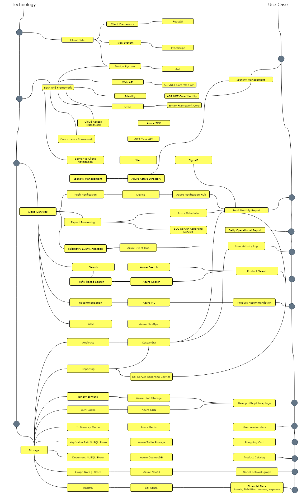

# Awesome Cloud Architecture

While building a scalable system is lot more easier with the advent of cloud technologies, identifying the right fit can be challenging. Usually it may take years of solid experience in architectural space. 

Here we’ve tried to summarize a list of top technologies that can be used to build scalable systems efficiently. 

Few fundamental or basic considerations, such as programming/scripting languages, operating system choices, additional tooling etc have been intentionally ignored to make the list simple.

## Give a Star! :star:

If you like or are using this project to learn or start your solution, please give it a [star](https://github.com/EISK/eisk). 

## Table

| Type        | Purpose                              | Use Case                                     | Technology                             |
|-------------|--------------------------------------|----------------------------------------------|----------------------------------------|
| Client Side | Client Framework                     |                                              | ReactJS	                             |
| -           | Type System                          |                                              | TypeScript                             |
| -           | Design System                        |                                              | Ant                                    |
| Backend     | Server Side API Framework            |                                              | ASP.NET Web API                        |
| -           | Concurrency Framework                |                                              | .NET Task API                          |
| -           | Web Application & API Deployment     |                                              | Azure Web Role                         |
| -           | Relational Data Access Framework     | Financial Data - Assets, liabilities, income | Entity Framework                       |
| -           | Cloud Access Framework               | Cloud storage access, logging etc            | Azure SDK                              |
| -           | Web Socket                           | Sending monthly summary report               | SignalIR                               |
| Services    | Telemetry Event Ingestion            | User activity log (receive)                  | Azure Event Hub                        |
| -           | Enterprise Search                    | Product search                               | Azure Search                           |
| -           | Prefix-based Search                  | Product search (with prefix)                 | Azure Search							 |
| -           | Recommendation                       | Product recommendation                       | Azure ML                               |
| -           | Server to Client Notification        | Sending monthly summary report               | Azure Notification Hub                 |
| -           | Report Processing		    		 | Sending monthly summary report               | Azure Scheduler                        |
| -           | Report Processing                    | Daily operational report                     | Sql Server Reporting Service           |
| Storage     | Analytics				             | User activity log			                | Cassandra                              |
| -           | Reporting                            | Daily operational report                     | Sql Server Reporting Service           |
| -           | Reporting                            | Monthly summary report                     	| Cassandra						         |
| -           | Binary content                       | User profile picture, logo                   | Azure Blob Storage                     |
| -           | CDN Cache                            | User profile picture, logo (cached)          | Azure CDN                              |
| -           | In Memory Cache                      | User session data                            | Azure Redis Cache                      |
| -           | Key Value Pair NoSQL Store           | Shopping cart                                | Azure Table Storage                    |
| -           | Document NoSQL Store                 | Product catalog                              | Azure CosmosDB                         |
| -           | Graph NoSQL Store                    | Social network graph                         | Neo4J                                  |
| -           | RDBMS 			                     | Financial Data - Assets, liabilities, income | Sql (Azure) Database                   |
| ALM         | ALM                                  |                                              | Azure DevOps                           |

## Open Source Project on Awesome Cloud Architecture

EISK is an open source project that is intended providing developer resources to build scalable applicatations on top of awesome cloud architecture. 

Already a [web api](https://github.com/EISK/eisk.webapi) project has been released to illustrate implementation best practices and more to come.

Stay in touch for updates by bookmarking the project in [github](https://github.com/EISK/eisk).

Enjoy!
